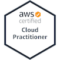
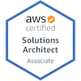
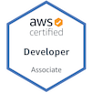
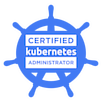

# K. Scott Eppler
Cloud Engineer, Automation Developer

[{:height="100" width="100"}](https://www.certmetrics.com/amazon/public/badge.aspx?i=9&t=c&d=2019-04-23&ci=AWS00254133)
[{:height="100" width="100"}](https://www.certmetrics.com/amazon/public/badge.aspx?i=1&t=c&d=2018-11-01&ci=AWS00254133)
[{:height="100" width="100"}](https://www.certmetrics.com/amazon/public/badge.aspx?i=2&t=c&d=2018-11-14&ci=AWS00254133)
[{:height="100" width="100"}](https://www.youracclaim.com/badges/922356d4-fb6b-42dc-b475-dad0c0532dd3/public_url)

<a href="mailto:k.scott.eppler@gmail.com">k.scott.eppler@gmail.com</a> |
<a href="tel:9189942377">918.994.2377</a> |
<a href="https://github.com/audioboxer217" target="_blank">GitHub</a> (<a href="https://hacknical.com/audioboxer217/github?locale=en" target="_blank">stats</a>)

## Currently

Assisting clients with Kubernetes, Amazon Web Services,  Terraform, and Ansible.

## Education

`2002-2006`
__Oklahoma State University - Institute of Technology__, Okmulgee, Oklahoma

- BT, Information Assurance and Digital Forensics

`2002-2005`
__Oklahoma State University - Institute of Technology__, Okmulgee, Oklahoma

- AAS, Information Technology and Computer Networks

## Experience

`08/2016-Present`
__Coda Global__, US - Remote

_Sr. Cloud Engineer_ - Assist clients with their move to a Cloud-based, DevOps style approach for their applications.  This includes infstructure work as well as CI/CD Pipeline development and getting started with container technology.

`06/2015-07-2016`
__Avnet__, Phoenix, AZ - Remote

_Sr. Cloud Consultant_ - Assist clients in implementing Cloud and Datacenter automation solutions. Including standing up new environments, transforming existing environments and crafting automation solutions to handle various items and problems.

`01/2012-06/2015`
__Hewlett-Packard__, Tulsa, OK

_Automation Developer_ - Engineer and Develop processes & procedures, HP Operations Orchestration Workflows, HP Server Automation scripts, websites (typically LAMP-based), and any other automation or process streamlining initiative. Also assist in maintaining and supporting those items and initiatives.

`10/2008-01/2012`
__Hewlett-Packard__, Tulsa, OK

_Technical Lead_ - Responsible for working with customers to ensure that monitoring and documentation are correct and up to standards.  Main point-of-contact for all midrange technical issue relating to servers within my assigned applications.

`07/2006-01/2009`
__Hewlett-Packard / EDS__, Tulsa, OK

_Jr. System Administrator_ - Responsible for the troubleshooting and escalation of application, OS, and hardware issues on mid-range level servers. Worked with documentation to determine severity level, troubleshoot and repair impacts and outages on servers with 24/7 availability, and escalate issues to the proper groups or personnel when necessary.

`10/2005-07/2006`
__Oral Roberts University__, Tulsa, OK

_PC Support Specialist_ - PC and Mac support technician responsible for the setup, troubleshooting, repair, maintenance, inventory, and assignment/reassignment of computer hardware, networking, peripheral devices, and software.

`08/2002-08/2005`
__Oklahoma State University - Institute of Technology__, Okmulgee, OK

_PC Support Technician, Work-study_ - Work-study support technician responsible for the troubleshooting, repair, maintenance, inventory, and assignment/reassignment of computer hardware, networking, peripheral devices, and software.  Also installed and repaired cabling (primarily Cat5).

## Tools and Languages
__Kubernetes__ Helped clients get started with installing and configuring Kubernetes clusters as well as moving applications into Kubernetes-based solutions

__Ansible__ Tackled large infrastructure configuration projects utilizing Ansible.

I have also worked with __Terraform__, __Python__, __Docker__, __Amazon Web Services__, __VMWare Suite__

## Current Certifications

__AWS Certified Cloud Practitioner__

__AWS Certified Solutions Architect - Associate__

__AWS Certified Developer - Associate__

__CNCF Certified Kubernetes Administrator__

## Past Certifications

__A+__

__Associate Computing Professional (ACP) in Networks and Microcomputing__

__HP ATP - Operations Orchestration v10__

__VMWare VTSP 2015__

<!-- ### Footer

Last updated: Apr 2019 -->

